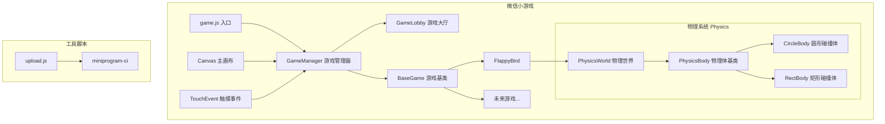

## 产品概述

一个微信小游戏集合平台，作为多个小游戏的入口和管理中心。玩家可以在主界面选择不同的小游戏进入游玩，每个小游戏可随时返回主界面。项目采用可扩展的架构设计，所有小游戏继承统一基类，便于后续新游戏的添加。

## 核心功能

1. **主界面（游戏大厅）**：展示所有可用小游戏列表，提供游戏选择入口，显示游戏图标、名称和简介
2. **游戏基类架构**：定义统一的游戏生命周期接口（初始化、更新、渲染、暂停、恢复、销毁），提供返回主界面功能
3. **可复用物理系统**：提供速度、加速度计算，支持圆形和矩形碰撞体，包含调试可视化功能
4. **FlappyBird示例游戏**：经典飞鸟过管道游戏，使用物理系统实现小鸟（圆形碰撞体）和管道（矩形碰撞体）的碰撞检测
5. **自动化上传工具**：基于miniprogram-ci的自动化上传脚本，支持版本号配置和上传进度显示

## 技术栈

- **开发语言**：JavaScript (ES6+)
- **运行平台**：微信小游戏
- **渲染方式**：Canvas 2D
- **触控事件**：wx.onTouchStart / wx.onTouchEnd
- **工具脚本**：Node.js + miniprogram-ci

## 实现方案

### 整体策略

采用面向对象的架构设计，以 `BaseGame` 作为所有小游戏的抽象基类，定义统一的生命周期方法。主界面 `GameLobby` 负责游戏的加载、切换和管理。使用 Canvas 2D 进行渲染，通过微信小游戏的触摸事件 API 处理用户交互。

### 关键技术决策

1. **游戏基类设计**：采用模板方法模式，基类定义游戏生命周期骨架（init/update/render/pause/resume/destroy），子类实现具体逻辑
2. **游戏循环**：使用 requestAnimationFrame 实现60fps的游戏主循环，统一管理更新和渲染
3. **状态管理**：通过 GameManager 单例管理当前游戏状态、场景切换、资源释放
4. **触控处理**：基类封装触控事件注册/注销，子类只需重写 onTouch 方法
5. **物理系统设计**：独立的 Physics 模块，包含 PhysicsWorld（物理世界）、PhysicsBody（物理体基类）、CircleBody（圆形碰撞体）、RectBody（矩形碰撞体），支持速度/加速度计算和碰撞检测

### 性能考量

- 使用离屏Canvas预渲染静态元素，减少每帧绘制开销
- 对象池复用管道、粒子等频繁创建的对象
- 游戏切换时完全释放上一个游戏的资源，避免内存泄漏

## 实现细节

### 微信小游戏规范遵循

- 入口文件 `game.js` 作为执行逻辑主入口
- 配置文件 `game.json` 设置屏幕方向、设备方向等
- 项目配置 `project.config.json` 配置 AppID、编译选项等
- 使用 `wx.createCanvas()` 创建主画布
- 使用 `wx.getSystemInfoSync()` 获取屏幕尺寸适配

### 游戏基类核心接口

```javascript
class BaseGame {
  // 生命周期方法
  init()      // 初始化游戏资源
  update(dt)  // 更新游戏逻辑
  render(ctx) // 渲染游戏画面
  pause()     // 暂停游戏
  resume()    // 恢复游戏
  destroy()   // 销毁游戏，释放资源
  
  // 交互方法
  onTouchStart(e) // 触摸开始
  onTouchEnd(e)   // 触摸结束
  
  // 通用方法
  backToLobby()   // 返回主界面
}
```

### 注意事项

- 游戏切换时确保移除所有事件监听器，防止内存泄漏
- FlappyBird 物理参数需根据屏幕尺寸动态调整
- 上传脚本需配置 IP 白名单和下载代码上传密钥
- 物理系统调试模式仅在开发时开启，发布前关闭以提升性能

### 物理系统设计

物理系统是一个独立可复用的模块，为游戏提供基础的物理模拟功能：

#### 核心组件

1. **PhysicsBody（物理体基类）**

- 位置 (x, y)
- 速度 (vx, vy)
- 加速度 (ax, ay)
- update(dt) 方法：根据加速度更新速度，根据速度更新位置

2. **CircleBody（圆形碰撞体）**

- 继承 PhysicsBody
- 额外属性：radius（半径）
- 用于：小鸟、球类等圆形物体

3. **RectBody（矩形碰撞体）**

- 继承 PhysicsBody
- 额外属性：width（宽度）、height（高度）
- 用于：管道、墙壁、平台等矩形物体

4. **PhysicsWorld（物理世界）**

- 管理所有物理体
- 提供碰撞检测方法：
    - circleVsCircle：圆形与圆形碰撞
    - circleVsRect：圆形与矩形碰撞
    - rectVsRect：矩形与矩形碰撞
- 调试渲染：debugDraw(ctx) 方法，用不同颜色绘制碰撞体边界

#### 调试可视化

- 圆形碰撞体：绿色圆圈边框
- 矩形碰撞体：蓝色矩形边框
- 碰撞时：变为红色高亮显示
- 通过 PhysicsWorld.debugMode 开关控制

## 架构设计

### 系统架构图



### 核心模块

- **GameManager**：游戏管理器单例，负责游戏循环、场景切换、资源管理
- **GameLobby**：游戏大厅界面，展示游戏列表，处理游戏选择
- **BaseGame**：游戏基类，定义统一接口和通用功能
- **Physics**：物理系统模块，包含 PhysicsWorld、PhysicsBody、CircleBody、RectBody
- **FlappyBird**：示例游戏实现，继承BaseGame，使用物理系统进行碰撞检测

### 数据流

用户点击 → TouchEvent → GameManager → 当前场景(Lobby/Game) → 更新状态 → Canvas渲染

## 目录结构

```
minigame-platform/
├── game/                           # [NEW] 微信小游戏主体目录
│   ├── game.js                     # [NEW] 游戏入口文件，初始化GameManager并启动游戏循环
│   ├── game.json                   # [NEW] 游戏配置文件，设置屏幕方向为竖屏
│   ├── project.config.json         # [NEW] 项目配置文件，配置AppID、编译选项、ES6转ES5等
│   ├── js/                         # [NEW] JavaScript源代码目录
│   │   ├── base/                   # [NEW] 基础类目录
│   │   │   └── BaseGame.js         # [NEW] 游戏基类，定义init/update/render/pause/resume/destroy生命周期方法，封装触摸事件处理和返回大厅功能
│   │   ├── physics/                # [NEW] 物理系统目录
│   │   │   ├── PhysicsWorld.js     # [NEW] 物理世界，管理所有物理体，提供碰撞检测和调试渲染
│   │   │   ├── PhysicsBody.js      # [NEW] 物理体基类，包含位置、速度、加速度属性和update方法
│   │   │   ├── CircleBody.js       # [NEW] 圆形碰撞体，继承PhysicsBody，添加radius属性
│   │   │   └── RectBody.js         # [NEW] 矩形碰撞体，继承PhysicsBody，添加width/height属性
│   │   ├── manager/                # [NEW] 管理器目录
│   │   │   └── GameManager.js      # [NEW] 游戏管理器单例，负责Canvas初始化、游戏循环(requestAnimationFrame)、场景切换、触摸事件分发
│   │   ├── scenes/                 # [NEW] 场景目录
│   │   │   └── GameLobby.js        # [NEW] 游戏大厅场景，渲染游戏列表UI、处理游戏选择点击、管理游戏注册信息
│   │   ├── games/                  # [NEW] 小游戏实现目录
│   │   │   └── flappybird/         # [NEW] FlappyBird游戏目录
│   │   │       ├── FlappyBird.js   # [NEW] FlappyBird主类，继承BaseGame，创建物理世界，使用CircleBody作为小鸟，RectBody作为管道
│   │   │       ├── Bird.js         # [NEW] 小鸟类，包含CircleBody物理体，处理跳跃逻辑和渲染
│   │   │       └── Pipe.js         # [NEW] 管道类，包含两个RectBody物理体（上下管道），处理移动和渲染
│   │   └── utils/                  # [NEW] 工具函数目录
│   │       └── utils.js            # [NEW] 通用工具函数，包含屏幕适配、随机数生成、碰撞检测等
│   └── images/                     # [NEW] 图片资源目录
│       ├── lobby/                  # [NEW] 大厅图片资源
│       │   └── bg.png              # [NEW] 大厅背景图
│       └── flappybird/             # [NEW] FlappyBird游戏图片资源
│           ├── bird.png            # [NEW] 小鸟精灵图
│           ├── pipe.png            # [NEW] 管道图片
│           └── bg.png              # [NEW] 游戏背景图
└── tools/                          # [NEW] 工具脚本目录
    ├── upload.js                   # [NEW] 自动化上传脚本，使用miniprogram-ci实现代码上传，支持版本号、描述配置，显示上传进度
    ├── package.json                # [NEW] Node.js项目配置，声明miniprogram-ci依赖
    └── README.md                   # [NEW] 工具使用说明文档，包含密钥配置、IP白名单设置、使用方法
```

## 关键代码结构

### 游戏基类接口

```javascript
// BaseGame.js - 游戏基类核心接口定义
class BaseGame {
  constructor(gameManager) {
    this.gameManager = gameManager;
    this.isRunning = false;
    this.isPaused = false;
  }
  
  // 生命周期方法 - 子类必须实现
  init() {}                    // 初始化游戏资源和状态
  update(deltaTime) {}         // 更新游戏逻辑
  render(ctx) {}               // 渲染游戏画面
  pause() {}                   // 暂停游戏
  resume() {}                  // 恢复游戏
  destroy() {}                 // 销毁游戏，释放资源
  
  // 触摸事件 - 子类可选重写
  onTouchStart(touch) {}
  onTouchEnd(touch) {}
  
  // 通用方法
  backToLobby() {
    this.destroy();
    this.gameManager.showLobby();
  }
}
```

### 游戏管理器接口

```javascript
// GameManager.js - 游戏管理器核心接口
class GameManager {
  static instance = null;
  static getInstance() {}
  
  init() {}                           // 初始化Canvas和事件监听
  startGameLoop() {}                  // 启动游戏主循环
  switchToGame(GameClass) {}          // 切换到指定游戏
  showLobby() {}                      // 显示游戏大厅
  registerGame(gameInfo) {}           // 注册游戏信息
}
```

### 物理系统接口

```javascript
// PhysicsBody.js - 物理体基类
class PhysicsBody {
  constructor(x, y) {
    this.x = x;           // 位置X
    this.y = y;           // 位置Y
    this.vx = 0;          // 速度X
    this.vy = 0;          // 速度Y
    this.ax = 0;          // 加速度X
    this.ay = 0;          // 加速度Y（比如重力）
  }
  
  update(dt) {
    // 速度 = 速度 + 加速度 × 时间
    this.vx += this.ax * dt;
    this.vy += this.ay * dt;
    // 位置 = 位置 + 速度 × 时间
    this.x += this.vx * dt;
    this.y += this.vy * dt;
  }
  
  debugDraw(ctx) {}       // 调试绘制，子类实现
}

// CircleBody.js - 圆形碰撞体
class CircleBody extends PhysicsBody {
  constructor(x, y, radius) {
    super(x, y);
    this.radius = radius;
  }
  
  debugDraw(ctx) {
    // 绘制绿色圆圈边框
  }
}

// RectBody.js - 矩形碰撞体  
class RectBody extends PhysicsBody {
  constructor(x, y, width, height) {
    super(x, y);
    this.width = width;
    this.height = height;
  }
  
  debugDraw(ctx) {
    // 绘制蓝色矩形边框
  }
}

// PhysicsWorld.js - 物理世界
class PhysicsWorld {
  constructor() {
    this.bodies = [];           // 所有物理体
    this.debugMode = false;     // 调试模式开关
  }
  
  addBody(body) {}              // 添加物理体
  removeBody(body) {}           // 移除物理体
  update(dt) {}                 // 更新所有物理体
  
  // 碰撞检测方法
  circleVsCircle(c1, c2) {}     // 圆形 vs 圆形
  circleVsRect(circle, rect) {} // 圆形 vs 矩形
  rectVsRect(r1, r2) {}         // 矩形 vs 矩形
  
  debugDraw(ctx) {
    // 如果开启调试模式，绘制所有碰撞体边界
    if (!this.debugMode) return;
    this.bodies.forEach(body => body.debugDraw(ctx));
  }
}
```

## 设计风格

采用现代休闲游戏风格，色彩明快活泼，界面简洁直观。整体设计以卡通风格为主，适合微信小游戏的轻量化特点。

## 页面设计

### 1. 游戏大厅页面

- **顶部区域**：平台Logo和标题"小游戏集合"，使用渐变色背景增加视觉层次
- **游戏列表区域**：采用卡片式布局，每个游戏卡片包含游戏图标(圆角矩形)、游戏名称、简短描述，卡片带有轻微阴影和圆角，点击时有缩放反馈动画
- **底部区域**：版本信息展示

### 2. FlappyBird游戏页面

- **游戏区域**：蓝天白云背景，绿色管道障碍，黄色小鸟角色
- **顶部HUD**：左上角返回按钮(半透明圆形)，右上角实时分数显示
- **游戏开始界面**：居中显示"点击开始"提示文字，带有呼吸动画效果
- **游戏结束界面**：半透明遮罩层，显示最终得分、最高分、重新开始按钮、返回大厅按钮